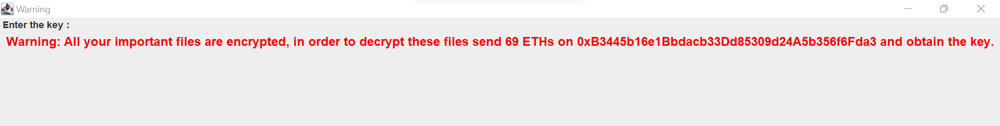
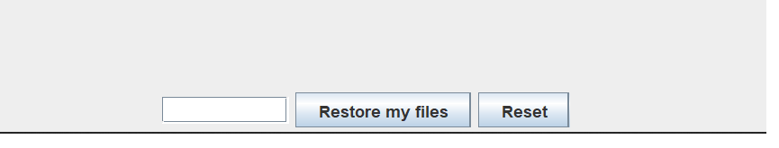

# Ransomware

This project is a Java-based ransomware that features cross-platform compatibility, bytecode obfuscation, operating-system detection, user detection and a warning message screen for entering the key for decrypting the file.

## Features

- Cross-platform compatibility 
- Bytecode obfuscation 
- Operating-system detection 
- User detection 
- Warning message screen for entering the key for decrypting the file

## System Requirements

- Java 8 or higher
- Apache Maven 3.6.3 or higher
  

## How to clone the repository
```bash
> git clone https://github.com/jaywyawhare/Ransomware
```

## How to use it
```bash
> cd Ransomware
> bash setup.sh
> bash run.sh
```

## DEMO IMAGE

- Warning message screen for entering the key for decrypting the file
  


- Text box for entering the key for decrypting the file


